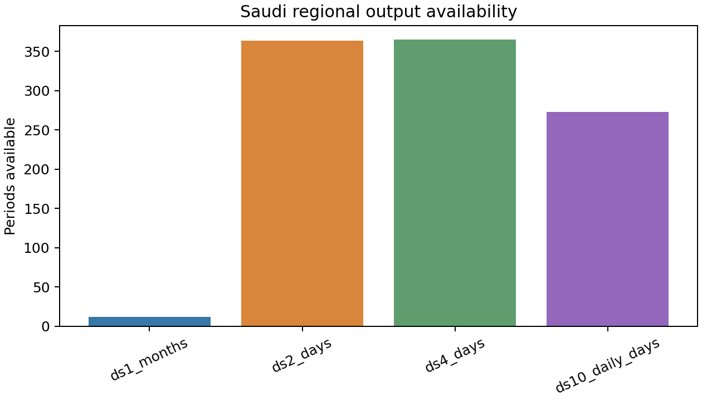
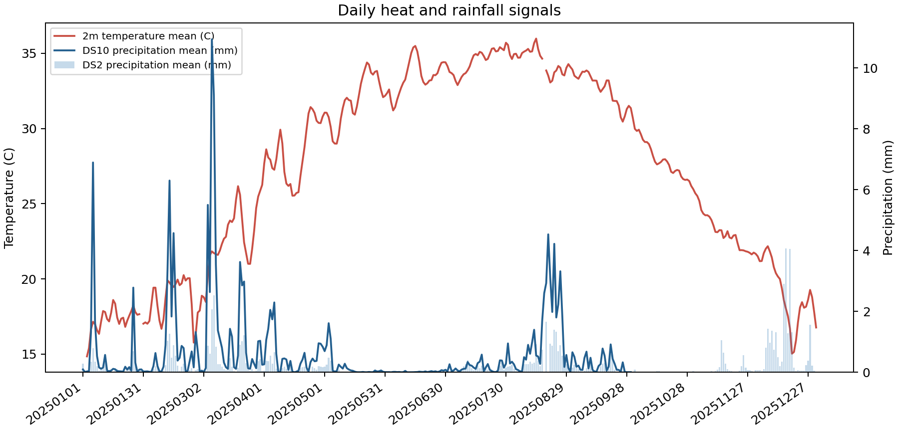
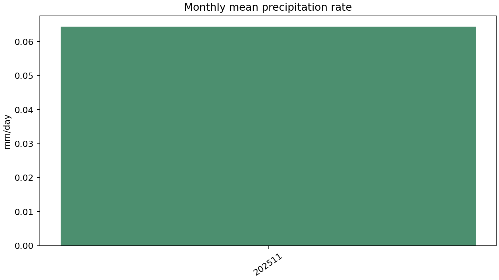
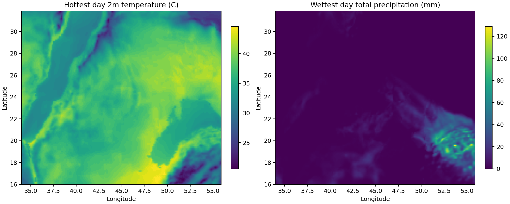

# 沙特区域气象数据洞察分析报告

- 数据来源：`/Volumes/E/气象数据/saudi_region_output`
- 生成时间：`2026-07-07T00:15:51`
- 月尺度样本：12 个；日尺度样本：364 天；SST 样本：365 天；卫星降水日聚合：273 天。

## 核心洞察

- 区域平均 2m 气温最高日为 **20250814**，平均约 **35.98 C**。
- DS2 日累计降水区域平均最高日为 **20251216**，平均约 **4.06 mm**。
- DS10 卫星降水日聚合最高日为 **20250306**，区域平均约 **10.94 mm**。
- 月平均降水率最高月份为 **202511**，区域平均约 **0.06 mm/day**。
- DS1 月平均降水率共有 1/12 个月存在有效数值，其余月份为缺测或填充值。

## 可视化

## 指标说明

- `t2m_mean_c`：DS2 日地表 2 米气温，已从 K 转换为 C。
- `tp_mean_mm`：DS2 日累计总降水，按裁剪区域求平均。
- `ds10_daily_total_mean_mm`：DS10 高频卫星降水日聚合结果，脚本会跳过 `date`、`source_files` 等非数值字段。
- `precip_mmday_mean`：DS1 月平均降水率，按 `prate * 86400` 转换为 mm/day。

## 数据质量提示

- 本报告是初步洞察分析，重点用于快速识别时间变化、空间热点和数据覆盖情况。
- 原目录中存在 macOS `._*` 元数据文件，分析过程已跳过。
- 报告摘要同时写入 `summary.json`，便于后续自动化建模或仪表盘复用。
