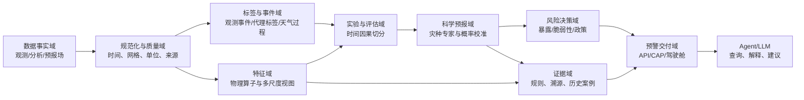

# 面向竞赛与论文的沙特多灾种自有预警框架

## 1. 设计结论

建议把自有系统分成两个共享内核、不同叙事的产品面：

- **科研面**：先聚焦极端高温和山洪，建立可信的 `t→t+1` 日尺度基线，再研究“灾种感知的多尺度空间融合”。论文只使用无泄漏实验和可追溯标签形成结论。
- **竞赛面**：在同一预测内核上展示高温、山洪、沙尘和沿海风险，加入知识证据、影响对象、CAP/API、轻量部署和受控报告；尚无可靠模型的灾种必须标为规则或试验能力。

整体系统继续使用工作名 **MAZU-Saudi HAMF**。文献查新表明，“多尺度 + MoE/动态门控 + 物理方向图”已有大量近邻，因此 HAMF 只作为系统框架与强基线，不再作为主要算法原创声明。计算机方法候选升级为 **MCR-Hazard**（Mechanism-Constrained Routing for Extreme Hazards），详细判定见 [HAMF 创新假设文献查新](hamf_novelty_review.md)。

## 2. 从参考工程继承什么

| 来源 | 吸收的优点 | 明确拒绝的做法 |
|---|---|---|
| LightGBM + 空间传播工程 | 灾种差异化传播、SHAP、处置矩阵、完整产品链 | 同日规则复现冒充预测、bbox 占比冒充事件命中 |
| XGBoost 迭代工程 | 多日窗口、负结果记录、GSOD+ERA5 实测跨年线 | 重叠窗口随机切分、测试集调阈值 |
| IFS + KG 规则工程 | 指标 DAG、来源溯源、统计极端度、预报场解译 | 单年气候态、错误 Copula 命名、错误 lead fallback |
| GitHub 次日预测工程 | 明确 `t→t+1`、时序留出、PR/校准指标、空间机制对照 | 规则标签作为最终真值、固定平滑跨灾种复用 |
| 13 区 Agent 工程 | 区域聚合、连续输出、API/前端、LLM 只解释 | 当前入口同日训练、跨代阈值、未来案例泄漏 |

## 3. 能力分级

框架不应把所有功能都包装成同一成熟度。每个灾种和时效必须标记能力级别：

| 级别 | 名称 | 允许的输入 | 可以宣称什么 |
|---|---|---|---|
| L0 | 物理诊断 | 当前或历史观测事实 | 同期条件是否满足，不称预报 |
| L1 | 研究预报 | 历史可用特征，严格 `t→t+1` | 日尺度样本外预测性能 |
| L2 | 预报场解译 | IFS/AIFS 等带起报时刻的预报场 | 对指定 lead time 的风险解译 |
| L3 | 业务试运行 | 稳定数据流、校准概率、政策与监控 | 受限范围内的准业务预警 |

当前仓库整体处于 L0 数据/指标底座，部分数据可进入 L1。比赛故事中的 3 小时预警属于未来 L2/L3 目标，不能写成现有实绩。

## 4. 总体架构



### 4.1 数据事实域

职责：保存不可变的数据来源和时间语义，不直接生成预警。

- `ObservedField`：站点、DS2、DS10、SST、云图等观测或分析事实。
- `ForecastField`：IFS/AIFS 等按起报时刻与有效时刻组织的预报场。
- `StaticField`：地形、Wadi、海陆掩膜、沙源、行政边界和承灾体。
- `DataAvailabilityMask`：缺测、延迟、站点距离、源产品版本和质量标记。

最重要的约束是：分析场与预报场不能只因变量名相同就互换。训练使用预报场时，应优先使用历史 hindcast；若只能用分析场训练，必须单独评估 analysis-to-forecast distribution shift。

### 4.2 标签与事件域

标签按可信度分层，而不是把规则标签重新命名为真值：

1. **金标签**：NCM/官方告警、站点极值、灾情记录或经人工核验的事件时空表。
2. **银标签**：多源观测共同确认，例如 DS10 强降水 + DS2 累积降水 + 站点或报道。
3. **代理标签**：`flash_flood_risk`、热浪规则或其他物理筛查分数。

金/银标签用于最终测试；代理标签用于预训练、辅助任务、正例候选生成或 weak supervision。每条标签至少包含：

```text
event_id, hazard, spatial_geometry, start_time, end_time,
label_value, label_confidence, source_refs, availability_time
```

天气过程聚类用于把同一天气系统的格点和连续日期归为同一组，防止它们跨越训练与测试边界。

### 4.3 科学预报域

第一阶段不要直接上复杂深度网络。按以下顺序建立可信增量：

1. 气候频率、持续性和规则基线。
2. 每灾种独立 HistGradientBoosting/XGBoost 基线。
3. 固定邻域均值、局地极值和方向邻域的空间对照。
4. 数据量足够后实现 HAMF-Light。

模型唯一主输出是：

```text
HazardForecast {
  hazard,
  forecast_origin,
  valid_time,
  lead_time_hours,
  spatial_unit,
  probability,
  calibrated_probability,
  uncertainty,
  model_bundle_id,
  data_quality
}
```

不在该对象中写入预警等级、LLM 文本或“证据置信度”。

### 4.4 风险决策域

风险不是灾害概率的别名。推荐保留可解释的分量：

```text
RiskAssessment = f(HazardProbability, Exposure, Vulnerability, Policy)
```

- `HazardProbability` 来自科学模型，不能被 Agent 改写。
- `Exposure` 描述人口、道路、港口、学校、电网、农业等暴露对象。
- `Vulnerability` 描述 Wadi、地形、城市排水、热敏感人群等易损性。
- `Policy` 定义不同部门、灾种和时效的行动阈值。

如果暂时没有可靠承灾体数据，竞赛版可以展示 hazard-only 等级，但必须明确它不是完整影响风险。

### 4.5 证据与交付域

知识层保留三种不同对象：

- **指标溯源图**：变量来自哪里、如何计算、质量如何。
- **灾害机理图**：哪些物理过程支持或反驳预报。
- **影响行动图**：哪些区域、对象和部门需要采取什么行动。

Agent 只能调用版本化工具读取预测、规则、案例、区域暴露和文献，不允许自行计算或覆盖概率。历史案例必须满足 `case.start_time < forecast_origin`，并保留来源；没有来源的案例只能标为演示资料。

## 5. HAMF-Light 基线与 MCR-Hazard 科研核心

HAMF-Light 不强迫所有灾害使用一种空间编码，而为每个灾种和预报时效学习三类信息的组合权重。它用于验证参考工程暴露出的空间平滑矛盾，是强基线而非最终创新模型。

### 5.1 三条空间分支

1. **大尺度背景分支**：区域均值、邻域平滑、季节与持续性，适合热浪、干旱背景。
2. **局地极值保持分支**：中心格点、局部 max/P90/P95、Top-k 强信号和多尺度 patch，适合短时强降水与山洪。
3. **方向图分支**：按低层风、IVT、坡向/Wadi 上游或沿岸方向建立动态邻接，适合水汽输送、沙尘和汇流路径。

可选第四条静态环境分支输入地形、距海距离、Wadi、沙源和土地覆盖，但暴露度不要混入灾害发生概率模型。

### 5.2 灾种与时效门控

对灾种 `h` 和时效 `l`：

```text
z = α_background(h,l) · z_background
  + α_local(h,l)      · z_local
  + α_directional(h,l)· z_directional
```

权重由灾种、时效、季节和数据可用性共同决定，并通过 softmax 约束为可解释比例。缺少 DS10 时不能用日累计降水伪造短时分支，而应降低该分支权重并增加不确定性。

### 5.3 MCR-Hazard：机制约束路由

HAMF-Light 验证有效后，不再继续堆叠更多分支，而把算法问题改为：模型能否依据可观测物理机制选择传播专家，并在物理反事实下保持一致行为。

路由输入从单纯的灾种 ID 升级为机制状态：平流强度、对流不稳定度、水汽输送、地形汇流潜势、持续性、海岸耦合、lead time 和数据可用性。训练时用机制适用性软先验约束路由，并加入可证伪的反事实一致性，例如旋转风场、切断 Wadi 上游边、降低 CAPE/PWAT 或屏蔽关键模态后，专家权重和预测必须产生物理上合理的变化。

MCR-Hazard 的主假设是机制路由比灾种路由更能跨季节、跨区域泛化；尾部损失、概率校准和缺测感知作为必要的可靠性组件，不单独声明创新。

### 5.4 各灾种首选机制

| 灾种 | 首选时效 | 主分支 | 关键输入 | 初期状态 |
|---|---:|---|---|---|
| 极端高温 | 24h | 大尺度背景 + 时间持续 | Tmax/Tmin、距平、热指数、VPD、辐射、SST | 第一论文主任务 |
| 山洪/强降水 | 24h，后扩 3–12h | 局地极值 + 方向图 | DS10 峰值、CAPE/CIN、PWAT、IVT、地形/Wadi | 第一论文主任务 |
| 沙尘/强风 | 6–24h | 方向图 | 风矢量、土壤/裸地、能见度、沙源 | 标签齐备后进入模型 |
| 沿海风浪 | 6–24h | 方向图 + 海陆边界 | 风、有效波高、SST、岸线、港口 | DS7/预报场齐备后进入模型 |

当前最适合论文的双任务是高温与山洪，因为它们恰好能验证“平滑背景对持续性灾害有益、对局地灾害可能有害”的核心假设。

## 6. 无泄漏实验协议

### 6.1 切分原则

- 不允许随机拆分格点日或重叠时间窗口。
- 先按天气过程/完整日期分组，再切训练、验证、测试。
- 同一事件的所有空间单元必须处于同一 split。
- 标准化、缺测填充、特征选择、校准和阈值只能拟合训练或验证数据。
- 测试集只运行一次，之后新增假设必须创建新的冻结测试版本。

有多年数据时优先：早期年份训练、中间年份验证、最新完整年份测试，并补充滚动年份回测。只有 2025 单年时只能称为**初步季节外推实验**，采用多个 blocked folds，不能据此宣称跨年泛化。

### 6.2 指标体系

每灾种、每时效至少报告：

- 排序：PR-AUC 为主，ROC-AUC 为辅。
- 操作点：POD/Recall、FAR、Precision、CSI、F1、HSS。
- 概率：Brier Score、ECE、可靠性图。
- 空间：按事件计算命中、邻域容差命中和区域覆盖误差。
- 不确定性：按日期或天气过程 block bootstrap 的置信区间。
- 轻量化：参数量、CPU 延迟、内存和模型包体积。

### 6.3 必须保留的基线与消融

| 类型 | 实验 |
|---|---|
| 朴素基线 | 气候频率、持续性、规则 |
| 树模型 | HGB/XGBoost 无空间特征 |
| 空间对照 | 固定均值、局地极值、方向邻域 |
| HAMF 消融 | 去物理算子、去局地分支、去方向图、统一门控 |
| 标签消融 | 代理标签预训练与否、金/银标签微调 |
| 预报场实验 | analysis 输入与 forecast/hindcast 输入差异 |

论文的核心成功标准不是所有灾种都提升，而是能解释并验证：不同空间归纳偏置为何对不同灾种产生不同效果。

## 7. 模型与政策制品

为防止参考工程中的跨代阈值问题，发布时分为两个制品：

### 7.1 ModelBundle

```text
model + feature_contract + preprocessing + missingness_policy
+ calibrator + training_manifest + validation_report
```

以上内容共享一个不可变 `model_bundle_id`。任何一项变化都产生新版本。

### 7.2 WarningPolicyBundle

```text
compatible_output_semantics + thresholds + level_mapping
+ exposure_policy + audience_actions + policy_version
```

政策包可以更新，但必须声明兼容的灾害、时效、空间单元和概率语义。最终预警同时记录两个 ID。

## 8. 建议仓库结构

```text
src/mazu_saudi/
  data/             # 数据源适配、规范化、质量与时间契约
  labels/           # 事件表、代理标签、天气过程聚类
  features/         # 物理算子与三类空间视图
  models/           # 基线、HAMF-Light、校准与模型包
  evaluation/       # split、指标、bootstrap、泄漏审计
  risk/             # 暴露、脆弱性和政策包
  evidence/         # 指标溯源、机理规则、历史案例
  delivery/         # API、CAP、报告 schema
  agents/           # 只编排 delivery/evidence 的工具
configs/
  hazards/          # 每灾种特征、标签和时效声明
  experiments/      # 冻结实验配置
schemas/            # 数据、标签、预测、风险、预警契约
scripts/            # 薄 CLI，不承载业务逻辑
tests/
  unit/
  contracts/
  leakage/
  integration/
experiments/        # 指标摘要与 manifest，不提交大模型产物
docs/
```

现有 `saudi_data_extract.py` 和 `compute_indicators.py` 暂不需要立即搬迁。先用适配器封装其输出，等预测最小闭环稳定后再渐进迁移，避免为了目录整齐打断已验证的数据流程。

## 9. 分阶段实施

当前第一论文主线已收敛为 2001–2024 多区域干旱区短历时极端降水预测，以 IMERG 作统一卫星参考、独立站点/雷达作高置信评估，并将 2025 单年全球 MAZU 限定为自监督预训练、模态增益和传感器迁移数据。Wadi 山洪仅在未来获得独立水文/灾情真值后作为下游扩展。完整论文与实验路线见 [MCR-Precip 论文包](manuscript/README.md)；原 Wadi 数据蓝图保留在 [Nature Communications 级数据与论文蓝图](nature_communications_dataset_blueprint.md) 供后续参考。

### P0：契约与标签底座

- 落地时间、空间、数据质量、标签和预测 schema。
- 建立事件注册表和标签来源清单。
- 增加自动泄漏检查：未来字段、重叠窗口、跨 split 事件、未来案例。

验收：任一训练样本都能追溯到来源，且可证明其输入早于有效时刻。

### P1：可信 T+1 基线

- 高温和山洪分别训练规则、持续性和 HGB/XGBoost。
- 使用 blocked split、验证集校准、冻结测试。
- 产出第一版 ModelBundle 和模型卡。

验收：完整输出 PR-AUC、CSI、FAR、Brier/ECE 和过程级置信区间；不再出现同日诊断标 T+1。

### P2：HAMF-Light 论文实验

- 实现背景、局地极值和方向图三分支。
- 完成空间对照与消融。
- 用金/银标签做最终评估，代理标签仅作辅助。

验收：对主要假设给出统计区间和失败案例；若没有稳定提升，也能形成可信负结论。

### P3：多时效预报场接入

- 接入 IFS/AIFS hindcast/forecast 与高频 DS9/DS10。
- 明确 3/6/12/24h 的起报和有效时刻。
- 逐时效独立校准并监控分布偏移。

验收：每个展示时效都有对应历史回测，缺失 lead 不允许回退到任意文件。

### P4：竞赛交付

- 风险政策、知识证据、历史案例、CAP/API 和驾驶舱。
- 沙尘/沿海在证据不足时以 L0/L2 能力展示，不伪装成已训练模型。
- Agent 输出引用预测 ID、模型包、政策包和证据来源。

验收：相同输入可复现相同预警；LLM 关闭后核心预测和结构化预警仍完整可用。

## 10. 论文与比赛的推荐叙事

### 论文问题

> 在数据稀缺的沙漠极端天气场景中，灾种感知的空间归纳偏置，是否比统一邻域平滑更能兼顾大尺度持续性灾害与局地突发性灾害？

建议贡献点控制在三项：

1. 有严格时间因果与标签分层的沙特多源极端天气基准。
2. HAMF-Light 的灾种/时效门控多尺度空间融合。
3. 同时覆盖稀有事件能力、概率可靠性和轻量部署的完整评估。

### 竞赛问题

> 如何把多源气象数据转成可追溯、可部署、能服务不同部门的沙特本地化多灾种预警？

演示重点应是一次真实可回放过程：数据来源 → 多时效概率 → 空间证据 → 暴露对象 → CAP/部门建议。故事中的伤亡避免、提前量和概率必须标明是回放结果、模拟情景还是实际验证结果。

## 11. 下一步最小工作包

框架设计完成后，不应立刻实现前端或 GNN。第一个开发工作包建议只有四件事：

1. 定义 `ForecastSample`、`EventLabel`、`HazardForecast` 三个 schema。
2. 构建高温/山洪 `t→t+1` 样本，并增加时间泄漏单元测试。
3. 实现气候频率、持续性和 HGB 三类基线。
4. 生成一份不含 Agent 的冻结评估报告。

这四项完成后，才有资格决定 HAMF-Light 的具体网络结构，也才能判断现有一年数据是否足以训练神经模型。
