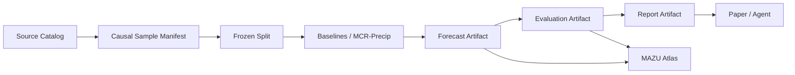

# 参考工程资产迁移到 MAZU-Saudi 的实施蓝图

## 1. 整理原则

八个参考工程不是八套要合并的代码，而是八组需要重新归类的设计证据。自有工程采用以下准入规则：

1. **概念可以吸收，源码默认不复制**：参考项目没有明确兼容许可证时，只按自有合同 clean-room 实现。
2. **先修证据链，再扩模型和页面**：时间、标签、切分、校准和制品不可信时，更复杂的模型只会制造更漂亮的错误。
3. **科研内核与产品层单向依赖**：服务、Agent 和页面可以读取冻结预测，但训练代码不能依赖服务或页面。
4. **基线与原创模型分开**：Analog、XGBoost 和机制模板用于对照，不塞入 MCR-Precip 后再宣称整体提升来自机制路由。
5. **成熟脚本先包裹、后迁移**：`saudi_data_extract.py` 和 `compute_indicators.py` 继续作为已验证入口，通过适配器消费其输出。

相关不可逆决策见 [ADR 0005](adr/0005-treat-reference-projects-as-design-inputs.md)。

## 2. 当前工程真实状态

| 层 | 当前已有 | 主要缺口 |
|---|---|---|
| 数据生产 | 沙特裁剪、指标计算、真实数据 QA | 统一 catalog、时间/可用性 manifest、多区域适配器 |
| 科研模型 | MCR-Precip 四专家、路由、损失、合成训练 | 真实 dataset builder、基线库、校准、正式 runner |
| 评估 | 像元级稀有事件与选择性指标 | 事件对象、跨区域、block bootstrap、冻结阈值 |
| 制品 | 简单 PyTorch model bundle | 实验锁、预测/评估/报告制品、哈希和 lineage |
| 产品 | MAZU Atlas demo API 与离线前端 | 冻结模型后端、任务状态、真实对象轨迹 |
| 论文 | 方法稿与 AI4Science 稿、证据矩阵 | 由冻结实验自动回填的结果和 source data |

所以第一个重构目标不是增加网络结构，而是打通：



## 3. 参考思想的落位矩阵

| 参考来源 | 吸收内容 | 自有落位 | 使用方式 | 禁止继承 |
|---|---|---|---|---|
| LightGBM + 空间传播 | 灾种/机制差异化空间算子 | `features/spatial.py`、基线配置 | 固定邻域、局地极值、方向传播对照 | 同日规则标签与原始高分 |
| XGBoost 迭代工程 | 多日统计、GSOD/ERA5 独立观测线、负结果记录 | `data/adapters/`、`baselines/trees.py` | 可信树模型基线与站点评估 | 重叠窗口随机切分 |
| IFS + KG 工程 | forecast-origin 数据组织、指标溯源、lead-time 解译 | `data/adapters/forecast.py`、`evidence/` | 历史预报/回报适配和来源查询 | 缺时效时任意文件回退 |
| 13 区 Agent 工程 | 区域聚合、服务编排、LLM 只解释 | `delivery/aggregation.py`、`service/` | 产品层摘要和报告 | 同日预测冒充 T+1、跨代阈值 |
| GitHub 次日预测 | PR-AUC/CSI/Brier/ECE、空间机制对照 | `evaluation/metrics.py`、`baselines/` | 统一 baseline harness | 规则标签作为最终真值 |
| 风险研判工程 | 预注册锁、真值隔离、四状态、Schema/SHA、失败降级 | `experiments/`、`artifacts/` | 整个正式实验的治理骨架 | 小样本结果和原始源码 |
| 生产实习工程 | Analog Ensemble、多时效诊断、可靠性图、混合基线 | `baselines/analog.py`、`evaluation/` | 在冻结切分下 clean-room 重做 | 随机格点切分、测试集校准 |
| 计科 2304 工程 | 小样本轻量模型、环流型相似思想 | `baselines/prototypes.py` | 训练折内机制原型基线 | 全年/未来事件模板 |

## 4. 目标目录与依赖方向

不做一次性搬家。保留现有 `mcr_precip/` 和 `service/`，围绕它们补齐边界：

```text
src/mazu_saudi/
  domain/
    time.py               # ForecastOrigin、ValidTime、AvailabilityTime
    observation.py        # 四状态与来源身份
    events.py             # EventId、WeatherEpisode、标签层级
    forecasts.py          # 预测语义，不含 UI/政策
  data/
    catalog.py            # 数据源版本、checksum、时间覆盖
    manifests.py          # 样本输入与标签 lineage
    adapters/
      saudi_indicators.py # 包裹现有指标输出
      imerg.py
      forecast.py
      terrain.py
    datasets/
      common_core.py
      mazu_rich.py
  splits/
    event_split.py
    leakage_audit.py
  baselines/
    climatology.py
    persistence.py
    optical_flow.py
    trees.py
    analog.py
    prototypes.py
  mcr_precip/             # 保留现有原创科研内核
  calibration/
    probability.py
    quantiles.py
  evaluation/
    metrics.py
    objects.py
    bootstrap.py
    comparisons.py
  experiments/
    lock.py
    runner.py
    registry.py
  artifacts/
    manifests.py
    forecast.py
    evaluation.py
    report.py
  evidence/
    provenance.py
    cases.py
  risk/                   # 后续，不进入第一篇降水论文
  service/                # 只读取 artifacts
configs/
  data/
  experiments/
  baselines/
  policies/
schemas/
  sample-manifest-v1.json
  experiment-lock-v1.json
  forecast-artifact-v1.json
  evaluation-artifact-v1.json
  report-artifact-v1.json
experiments/
  registry/               # 小型 manifest；不提交大数组/模型
```

依赖必须保持单向：

```text
domain
  ↑
data → splits → baselines / mcr_precip → calibration
  ↑                                  ↓
  └──────── experiments → artifacts → evaluation
                                      ↓
                              service / evidence / paper
```

禁止 `mcr_precip` 导入 `service`、`evidence` 或 `risk`；禁止页面在请求期间训练、校准或搜索阈值。

## 5. 五类核心合同

### 5.1 Source Record

每个源文件记录：

```text
source_id, source_version, checksum, valid_time,
availability_time, forecast_origin?, spatial_grid, variables, quality_state
```

其中 `quality_state` 只能是 `observed/not_observed/not_observable/conflicting`。不存在的未来标签必须是 `not_observable`，不能填 0。

### 5.2 Causal Sample Manifest

张量之外必须保存：

```text
sample_id, event_id, region_id, forecast_origin, valid_start, valid_end,
lead_hours, input_source_ids, label_source_ids, observability, split_id
```

`MCRPrecipBatch` 继续只承载高效张量；manifest 负责审计，两者通过稳定的 `sample_id` 对齐。

### 5.3 Experiment Lock

在最终测试前冻结：

```text
dataset_version, split_hash, feature_contract_hash, model_config_hash,
baseline_configs, calibration_method, decision_threshold_rule,
random_seeds, code_commit, preregistered_claims
```

锁定后不得根据测试结果覆盖原锁；新假设产生新 `experiment_id`。

### 5.4 Model Bundle

现有 `.pt` 包继续作为权重载体，但外部 manifest 必须把以下对象绑定到同一 `model_bundle_id`：

```text
weights, preprocessing, feature contract, missingness policy,
calibrator, training manifest, validation report, code commit, checksums
```

校准器与模型不可跨版本混用。业务阈值仍属于独立 Warning Policy，不进入论文模型包。

### 5.5 Forecast / Evaluation / Report Artifact

- `ForecastArtifact`：冻结预测、样本身份、模型/数据/实验锁 ID。
- `EvaluationArtifact`：标签版本、阈值来源、指标、事件级置信区间和失败案例。
- `ReportArtifact`：只引用前两者生成图表和叙事，不重新计算科学概率。

MAZU Atlas 和 Agent 只能消费这些制品。LLM 输出必须保留引用的 artifact ID。

## 6. 基线怎样整理

基线要形成独立统一接口，而不是散落为脚本：

```text
fit(train_manifest, train_arrays)
calibrate(validation_manifest, validation_predictions)
predict(test_manifest, test_arrays)
describe() -> model metadata
```

第一批必须实现：

1. 月份/区域气候频率；
2. 最近观测持续性；
3. 光流外推；
4. HGB/XGBoost；
5. Analog Ensemble；
6. 训练折内机制原型；
7. 同参数量稠密专家和无机制路由。

Analog 库和机制原型都只能从当前训练折生成。校准只用验证折，测试集禁止搜索 BestCSI、BestDIFF 或分位映射。

## 7. MCR-Precip 怎样接入

现有四专家模型不需要重写，只补三个外围适配层：

1. `ManifestDataset`：把 manifest 中的 source IDs 转成动态场、静态场、机制状态、availability 和标签张量。
2. `ExperimentRunner`：按 frozen split 训练基线与 MCR-Precip，保存原始预测。
3. `ArtifactPublisher`：检查锁、哈希、校准器和评估状态后发布 Model/Forecast/Evaluation artifacts。

新的 Analog/机制原型不会成为第五、第六个 MCR 专家。它们回答的是“传统类比或原型方法能否解释提升”，属于论文强基线。

## 8. MAZU Atlas 与 Agent 怎样接入

把 `DemoForecastService` 抽象为：

```text
ForecastBackend
  config()
  health()
  forecast(request)
  events()
```

保留 `DemoForecastBackend`，新增 `FrozenArtifactForecastBackend`。正式后端只能读取已经发布的 Forecast/Evaluation artifacts；没有匹配制品时返回 `unavailable`，不能回退为看似真实的 demo。

页面下一批新增内容应是：

- artifact/model/data/experiment ID；
- 数据四状态和 availability cutoff；
- 基线与 MCR-Precip 对比；
- 事件对象轮廓与轨迹；
- 校准图、risk–coverage 和跨区域结果；
- `forecast/abstain/unavailable/blocked` 状态。

知识图谱和 Agent 放在二级工作区，只负责溯源、检索已发生历史案例和生成带引用报告。

## 9. 分批迁移顺序

### Slice 1：实验骨架

- 新建 `domain/`、`artifacts/` 和 JSON Schemas。
- 实现 Source Record、Causal Sample Manifest、Experiment Lock。
- 加入未来字段、标签不可观测、事件跨 split、哈希变化测试。

**验收**：任意样本都能回答“何时可用、属于哪个事件、为何进入该 split”。

### Slice 2：可信切分与最小基线

- 建立事件/日期级 frozen split。
- 实现气候频率、真实持续性、HGB/XGBoost。
- 校准器只接收 validation predictions。

**验收**：测试代码无法调用 `fit()`；阈值来源写入 Evaluation Artifact。

### Slice 3：新增参考方法基线

- clean-room 实现 Analog Ensemble。
- clean-room 实现训练折内机制原型。
- 加入光流、普通时空模型或稠密专家对照。

**验收**：删除测试事件后训练资产哈希不变；把测试事件加入模板会被泄漏审计拒绝。

### Slice 4：MCR-Precip 真实数据闭环

- 实现 IMERG/历史预报/地形/MAZU adapters。
- 接入 `ManifestDataset` 和正式 runner。
- 发布 Model、Forecast 和 Evaluation artifacts。

**验收**：同一 experiment lock 可一键复跑；图表数字只来自 frozen artifacts。

### Slice 5：产品与论文消费

- 实现 `FrozenArtifactForecastBackend`。
- 页面展示真实模式与基线对照。
- 自动生成论文 source data、图表和报告制品。

**验收**：服务断开训练环境仍能读取已发布结果；Agent 无权修改预测。

## 10. 推荐提交拆分

每个切片继续拆成小提交：

1. `Define causal data and artifact contracts`
2. `Implement frozen event splits and leakage audits`
3. `Add trustworthy climatology and persistence baselines`
4. `Add clean-room analog and mechanism prototype baselines`
5. `Add validation-only calibration and block evaluation`
6. `Run MCR-Precip from frozen experiment manifests`
7. `Serve frozen forecast artifacts in MAZU Atlas`

不要把目录搬迁、数据下载、模型重写和前端改版放进同一个提交。

## 11. 当前建议

现在最合理的下一项实现是 **Slice 1：实验骨架**，不是继续开发页面或训练更多模型。它能同时吸收新增代码中价值最高的预注册、真值隔离、四状态、Schema 和 SHA，并为后续 Analog、机制原型、MCR-Precip 真实训练与论文结果提供共同入口。
