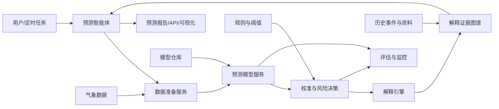
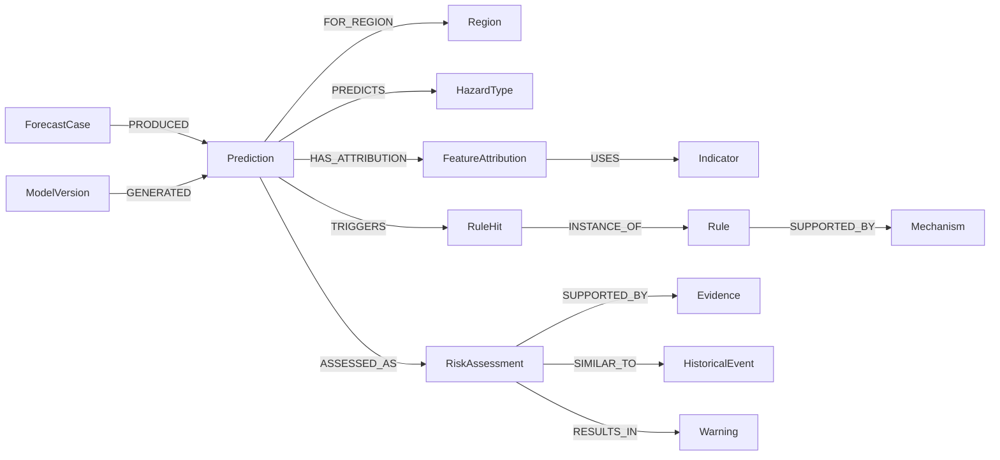

可以，而且这个方向比单纯做“知识图谱展示系统”更完整。建议把它定义成：

> 一个由预测模型产生数值结果、预测智能体负责编排、解释引擎生成可验证解释、知识图谱保存推理证据链的极端天气预测应用。

最重要的原则是：智能体负责组织和解释，预测模型负责计算。不要让大模型直接编造降水量、概率或预警等级。

## 推荐总体架构



建议拆成七个边界清楚的模块。

## 1. 数据准备层

负责读取和整理模型真正需要的数据：

- ERA5或其他气象数据
- 数值模式预报
- 城市和行政区划
- 历史极端天气事件
- 地形、人口、暴露度
- 实况和灾情资料

输出统一的 `ForecastCase`，不要让每个模型自己读取不同格式的数据。

```python
class ForecastCase:
    case_id: str
    initial_time: datetime
    target_time: datetime
    lead_time_hours: int
    region_ids: list[str]
    feature_version: str
    features: dict[str, float]
    source_files: list[str]
    input_hash: str
```

`input_hash` 很重要，可以证明某次预测到底使用了哪批数据。

## 2. 预测模型层

它只负责：

```text
输入特征 → 输出预测
```

模型可以包括：

- XGBoost、LightGBM等表格模型
- CNN、ConvLSTM、Transformer等时空模型
- 物理规则模型
- 多模型集成
- 后续训练的深度学习模型

所有模型统一实现一个接口：

```python
class ForecastModel:
    def predict(self, case: ForecastCase) -> PredictionResult:
        ...
```

输出不要只有最终等级，至少保留：

```python
class PredictionResult:
    prediction_id: str
    case_id: str
    model_id: str
    model_version: str

    hazard: str
    region_id: str
    target_time: datetime
    lead_time_hours: int

    probability: float
    calibrated_probability: float
    predicted_class: str
    uncertainty: float | None

    important_features: dict[str, float]
    model_input_hash: str
    created_at: datetime
```

预测结果必须带模型版本。否则模型更新后，无法复现以前的预测。

## 3. 校准与风险决策层

需要严格区分两个概念：

- `Prediction`：模型计算结果，例如暴雨概率0.78。
- `RiskAssessment`：结合阈值、区域暴露度和业务规则后的风险判断。

例如：

```text
暴雨概率：0.78
预测降水：42 mm
模型不确定性：中等

结合：
- 吉赞地区山洪敏感
- 降水超过橙色阈值
- CAPE超过强对流阈值

得到：
山洪风险等级：橙色
```

这样以后修改预警标准时，不需要重新训练模型。

推荐接口：

```python
class RiskPolicy:
    def assess(
        self,
        prediction: PredictionResult,
        context: RegionContext,
    ) -> RiskAssessment:
        ...
```

## 4. 解释引擎

解释应拆成三种，不能混在一起。

### 模型解释

回答“模型为什么给出这个概率”：

- SHAP特征贡献
- 关键变量排序
- 与正常值的偏差
- 不确定性
- 相似历史输入

示例：

```text
暴雨概率升高的主要模型因素：
1. CAPE：+0.21
2. 可降水量：+0.17
3. 日降水预测：+0.14
4. 850 hPa水汽输送：+0.08
```

### 物理机制解释

回答“气象上为什么可能发生”：

```text
高可降水量
→ 水汽供应充足
→ CAPE升高
→ 对流不稳定增强
→ 强降水概率上升
```

这一部分可以使用专家规则和知识图谱，但应该写成“支持机制”，不能冒充模型真实内部推理。

### 风险决策解释

回答“为什么发出这个等级”：

```text
暴雨概率0.78超过橙色阈值0.70；
吉赞属于山洪高敏感区域；
降水和CAPE两条规则同时命中；
因此输出橙色山洪风险。
```

最终解释对象可以这样设计：

```python
class PredictionExplanation:
    explanation_id: str
    prediction_id: str

    feature_contributions: list[FeatureContribution]
    rule_hits: list[RuleHit]
    physical_mechanisms: list[MechanismPath]
    similar_events: list[str]
    supporting_evidence: list[str]

    uncertainty_statement: str
    limitations: list[str]
```

## 5. 解释证据图谱

以之前最好的“风险研判”项目作为骨架，扩展成下面的结构：



推荐节点：

- `ForecastCase`
- `Prediction`
- `ModelVersion`
- `HazardType`
- `Region`
- `Indicator`
- `FeatureAttribution`
- `Rule`
- `RuleHit`
- `Mechanism`
- `RiskAssessment`
- `Warning`
- `HistoricalEvent`
- `Evidence`
- `AgentRun`

这样图谱既记录领域知识，也记录每一次真实预测。

需要注意：知识图谱不是预测模型的替代品。它主要承担：

- 保存预测上下文
- 保存解释链
- 查询相似案例
- 关联规则和物理机制
- 提供证据来源
- 支持智能体检索
- 支持审计和复现

## 6. 预测智能体

智能体建议定位成“预测任务编排器”。

它负责：

1. 理解用户请求。
2. 确认区域、灾种和预测时间。
3. 检查数据是否齐全。
4. 选择合适模型。
5. 调用模型服务。
6. 调用风险规则。
7. 调用解释引擎。
8. 查询图谱中的类似历史事件。
9. 生成带依据的报告。

智能体不能做的事情：

- 自己编造预测概率。
- 在数据缺失时假装模型已经运行。
- 擅自改变风险阈值。
- 把物理解释说成模型的真实内部推理。
- 隐藏模型版本和不确定性。

建议给智能体定义明确工具：

```text
load_forecast_case
validate_input_data
list_available_models
run_prediction
calibrate_probability
evaluate_risk
explain_prediction
query_similar_events
build_explanation_graph
generate_report
```

每次智能体运行也要保存：

```python
class AgentRun:
    agent_run_id: str
    request: str
    tool_calls: list[ToolCall]
    prediction_ids: list[str]
    status: str
    started_at: datetime
    finished_at: datetime
```

## 7. 应用层

前端至少做四个页面：

### 预测工作台

- 选择区域
- 选择灾种
- 选择预测时效
- 选择模型
- 发起预测

### 预测结果

- 风险概率
- 风险等级
- 时间和空间范围
- 不确定性
- 模型版本

### 解释页面

- 特征贡献图
- 命中规则
- 物理机制链
- 相似历史事件
- 支持证据

### 图谱页面

围绕当前预测展示局部子图，不要一次渲染全部节点。

## 推荐代码目录

```text
weather_prediction_app/
├── app/
│   ├── api/                         # HTTP接口
│   ├── application/                 # 用例编排
│   │   ├── run_prediction.py
│   │   ├── explain_prediction.py
│   │   └── generate_report.py
│   │
│   ├── domain/
│   │   ├── forecast.py
│   │   ├── prediction.py
│   │   ├── risk.py
│   │   ├── explanation.py
│   │   └── evidence.py
│   │
│   ├── models/
│   │   ├── base.py
│   │   ├── xgboost_model.py
│   │   ├── deep_model.py
│   │   └── ensemble.py
│   │
│   ├── agents/
│   │   ├── prediction_agent.py
│   │   ├── tools.py
│   │   └── prompts.py
│   │
│   ├── explanation/
│   │   ├── feature_attribution.py
│   │   ├── rule_explanation.py
│   │   ├── mechanism_explanation.py
│   │   └── narrative.py
│   │
│   ├── risk/
│   │   ├── rules.py
│   │   ├── calibration.py
│   │   └── policy.py
│   │
│   ├── knowledge_graph/
│   │   ├── bundle.py
│   │   ├── schema.py
│   │   ├── loader.py
│   │   ├── queries.py
│   │   └── verifier.py
│   │
│   └── infrastructure/
│       ├── weather_repository.py
│       ├── prediction_repository.py
│       ├── graph_repository.py
│       └── model_registry.py
│
├── configs/
│   ├── models/
│   ├── rules/
│   └── regions/
│
├── artifacts/
│   ├── models/
│   └── graph_bundles/
│
├── tests/
│   ├── unit/
│   ├── integration/
│   └── evaluation/
│
└── pyproject.toml
```

## 建议的第一版范围

第一版不要同时做很多灾种和模型。可以先做一个闭环：

1. 选择暴雨或极端高温。
2. 接入一个现有预测模型。
3. 输出区域概率。
4. 增加概率校准。
5. 实现5～10条风险规则。
6. 使用特征贡献解释模型结果。
7. 生成预测解释图谱。
8. 让智能体调用这些确定性工具。
9. 前端展示预测、解释和局部图谱。
10. 保存预测、模型版本、证据和运行日志。

这样第一版就已经具备：

> 数据进入 → 模型预测 → 风险判断 → 结果解释 → 图谱存储 → 智能体报告 → 事后验证

这是一个完整的预测应用，而不只是一个聊天界面或知识图谱演示。领域建模带来的关键约束是：必须把 `Prediction`、`RiskAssessment`、`Warning` 和 `AgentRun` 分成四个不同对象，后续系统才不会把模型结果、业务决策和智能体文字混为一谈。